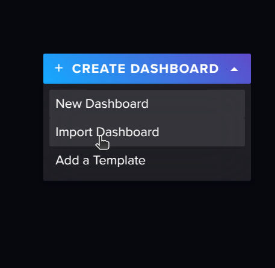
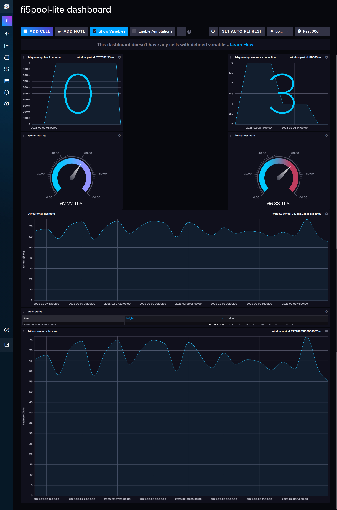

# Deploy fi5pool by docker-compse


## Before start


Before start mining ckb you need to prepare a ckb account to receive your mining reward. You can generate it by [ckb-cli](https://github.com/nervosnetwork/ckb-cli), the command:


```
$ ckb-cli account new
Your new account is locked with a password. Please give a password. Do not forget this password.
Password: 
Repeat password: 
address:
  mainnet: ckb1qzda0cr08m85hc8jlnfp3zer7xulejywt49kt2rr0vthywaa50xwsqf5fkkmdg3swk7e357vhhksqvsylvj4m6cmu4mr8
  testnet: ckt1qzda0cr08m85hc8jlnfp3zer7xulejywt49kt2rr0vthywaa50xwsqf5fkkmdg3swk7e357vhhksqvsylvj4m6c4w75fl
address(deprecated):
  mainnet: ckb1qyqrgnddk63rqadanrfue00dqqeqf7e9th4s3fqzvk
  testnet: ckt1qyqrgnddk63rqadanrfue00dqqeqf7e9th4svv7aq2
lock_arg: 0x344dadb6a23075bd98d3ccbded003204fb255deb
lock_hash: 0x80e97afd6a294235766d58513f6a283ae27d1b2e8b8b228b6e40253002db89db
```


:warning: **You must remember you password for unlocking you reward, if you lose it you will lose your token!**


We need the `lock_arg` of account info from `ckb-cli`, if you alread have a account like `ckb1qyqrgnddk63rqadanrfue00dqqeqf7e9th4s3fqzvk` but don't know the `lock_arg` you could use this command to get it:


```
$ ckb-cli util address-info --address ckb1qyqrgnddk63rqadanrfue00dqqeqf7e9th4s3fqzvk
extra:
  address-type: Short
  data-encoding: bech32
  new-format: ckb1qzda0cr08m85hc8jlnfp3zer7xulejywt49kt2rr0vthywaa50xwsqf5fkkmdg3swk7e357vhhksqvsylvj4m6cmu4mr8
lock_script:
  args: 0x344dadb6a23075bd98d3ccbded003204fb255deb
  code_hash: 0x9bd7e06f3ecf4be0f2fcd2188b23f1b9fcc88e5d4b65a8637b17723bbda3cce8
  hash_type: type
network: ckb
```

## Chose your mining plan

You can chose one from two plan: 1. `Minmum system`, 2. `Full system`

`Minmum system`: lowest hardware required, just run a mining pool and ckb node. You just need:

* 2C4G machine
* 200G storage space

`Full system`: `Minmum system` plus a Dashboard. For long-term operataion, you just need:
* 4C8G machine
* 500G storage space

### Minmum system

If you want to start mining asap, you can use minmum system.

```
cd deploy/lite
```

You only need to config your ckb-node

#### Config your CKB node

```
cd ckb-node
```

**You must need to change your own ckb reward receive address**

Use your own `lock-arg` from `Before start` to change `mainnet/ckb.toml` `[[block_assembler]`:

``` toml
[block_assembler]
code_hash = "0x9bd7e06f3ecf4be0f2fcd2188b23f1b9fcc88e5d4b65a8637b17723bbda3cce8"
args = "<your own lock-arg>"
hash_type = "type"
message = "0x666935626f782074657374" # fi5box test
```

Runing your own pool

```
cd deploy/lite
```

start containers:

```
docker compose up -d
```
Now you can use your mining machines to connect your pool `<your_pool_public_ip>:4610`, you can see your status through [CKB explorer](https://explorer.nervos.org/).

### Full system

Full system add influxdb providing dashboard, mining pool will write mining info into influxdb.

```
cd deploy/full
```

#### Config your influxdb
```
cd influxdb2
```
* prepare admin-account, you need set:
  * `admin-username`: admin account name
  * `admin-password`: admin account password
  * `admin-token`: admin api token

You can use `openssl` command to generate password and token in terminal:

```
$ openssl rand -base64 32
QYkxPYNVED4iHxiHMZ4oUxl/vTLEWKtSkBoHfZl9Qz0=
```

#### Config your mining pool

```
cd fi5pool
```

Please add `admin-token` into `config/config.toml`, just modify `token`:

```
difficulty = 2_000_000_000_000_000
pull_block_template_interval = 500
listen_address = "[::]:4610"
ckb_rpc_url = "http://ckb-node:8114"
rpc_timeout = 2000
[influx]
url = "http://influxdb2:8086"
org = "fi5"
token = "<admin-token>"
share_bucket = "share-bucket"
block_bucket = "block-bucket"
[log_config]
filter = "info"
rolling_file = ["/tmp/logs", "fi5pool"]
```

#### Config your CKB node

```
cd ckb-node
```

**You must need to change your own ckb reward receive address**

Use your own `lock-arg` from `Before start` to change `mainnet/ckb.toml` `[[block_assembler]`:

``` toml
[block_assembler]
code_hash = "0x9bd7e06f3ecf4be0f2fcd2188b23f1b9fcc88e5d4b65a8637b17723bbda3cce8"
args = "<your own lock-arg>"
hash_type = "type"
message = "0x666935626f782074657374" # fi5box test
```

#### Runing your own pool

```
cd deploy/full
```

##### First startup

For first startup, you need to initialize influxdb. So start influxdb container first:

``` shell
docker compose up -d influxdb2

# after container up
cd influxdb2
./start_influx.sh http://127.0.0.1:8086
```

You can see bucket generate:

```
ID                      Name            Retention       Shard group duration    Organization ID         Schema Type
721703b9ecb1c50d        share-bucket    60h0m0s         24h0m0s                 7e93526eb86109a8        implicit
ID                      Name            Retention       Shard group duration    Organization ID         Schema Type
55c7bbad2a93de35        block-bucket    infinite        168h0m0s                7e93526eb86109a8        implicit
ID                      Name            Retention       Shard group duration    Organization ID         Schema Type
c6b2d4621205c0db        log-bucket      1440h0m0s       24h0m0s                 7e93526eb86109a8        implicit
```

You can login influxdb use `admin-username` and `admin-password` at url: `http://127.0.0.1:8086/`


Now you can draw dashborad at `Dashboard` tab with `import dashboard` by template `fi5pool-lite_dashboard.json`.



Prepared influxdb, now you can start other containers: `ckb-node`, `fi5pool`
```
docker compose up -d
```
Now you can use your mining machines to connect your pool `<your_pool_public_ip>:4610`, after you starting mining, you could see your hashrate and block info in dashboard:


You also can see your status through [CKB explorer](https://explorer.nervos.org/).

Enjoy mining :smile: